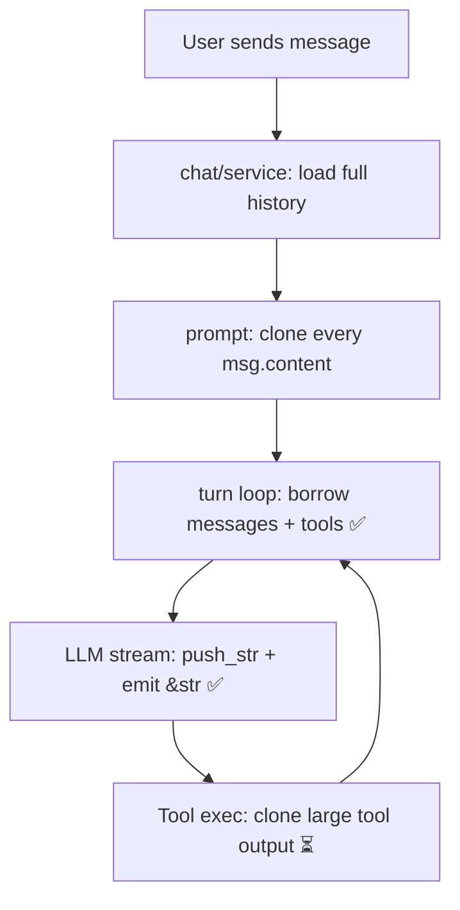

# Báo cáo: Clone nguy hiểm trong Rust codebase

Đã quét toàn bộ `src-tauri/src` (~450 lần `.clone()`). Dưới đây là các chỗ **thực sự đáng lo** — clone dữ liệu lớn, clone trong vòng lặp nóng, hoặc clone O(n²) — được gom theo feature.

**Tiêu chí “nguy hiểm”:**

- Clone buffer đang tăng dần (streaming, agent loop)
- Clone toàn bộ lịch sử chat / `Vec<ChatMessage>` lặp lại
- Clone output tool / file content lớn
- Clone schema JSON đệ quy mỗi request
- Clone không cần thiết khi đã có ownership hoặc reference

**Không liệt kê:** `Arc::clone`, `AppHandle::clone` cho async closure, clone ID ngắn — pattern bình thường trong Tauri.

**Chú thích trạng thái:** ✅ = đã fix · ⏳ = còn lại · — = chấp nhận được / không ưu tiên

---

## Tiến độ (P0 — đã merge)

| Hạng mục          | Thay đổi chính                                                                                                                                 |
| ----------------- | ---------------------------------------------------------------------------------------------------------------------------------------------- |
| **LLM streaming** | `MessageEmitter` nhận `&str`; providers emit chunk/complete qua reference; bỏ `content.clone()` + `full_content.clone()` mỗi chunk/cuối stream |
| **Agent loop**    | Thêm `LlmChatParams<'a>`; `turn.rs` borrow `&current_messages` + `tools.as_deref()` thay vì clone mỗi iteration                                |
| **SSE reasoning** | `SSEDelta::reasoning_text()` đọc reference, không clone 3 field mỗi chunk                                                                      |

---

## 1. Harness (Agent loop) — **Mức: CRITICAL**

| Trạng thái | File                                              | Vấn đề                                                                                                                                   |
| ---------- | ------------------------------------------------- | ---------------------------------------------------------------------------------------------------------------------------------------- |
| ✅         | `features/harness/turn.rs`                        | ~~**`current_messages.clone()` mỗi iteration**~~ → `LlmChatParams { messages: &current_messages, ... }`                                  |
| ✅         | `features/harness/turn.rs`                        | ~~**`tools.clone()`** mỗi iteration~~ → `tools.as_deref()` qua `LlmChatParams`                                                           |
| ⏳         | `features/harness/turn.rs:183,222-223`            | **`tool_calls.clone()`** — clone danh sách tool calls nhiều lần (filter permissions + push vào messages).                                |
| ⏳         | `features/harness/turn.rs:333-337,454-463`        | **`ToolExecutionContext` clone** (gồm `AppHandle` + 3 String) cho mỗi tool call.                                                         |
| ⏳         | `features/harness/turn.rs:364-365,385-387,437`    | **`llm_text.clone()`, `result_value.clone()`, `error_msg.clone()`** — duplicate output tool (có thể rất lớn từ `read_file`, MCP).        |
| ⏳         | `features/harness/adapters/prompt.rs:163,207-214` | Clone **`msg.content`** của mọi message lịch sử khi build prompt — bộ nhớ x2 toàn history mỗi turn.                                      |
| ⏳         | `features/harness/adapters/prompt.rs:289`         | `assistant_message_id.clone()` trong vòng lặp khi reconstruct tool calls.                                                                |
| ⏳         | `features/harness/session.rs:86-89,105`           | **`user_content.clone()`** + **`self.deps.clone()`** (Arc — OK) nhưng `TurnInput` chứa `history_before_user: Vec<Message>` đã owned sẵn. |
| ⏳         | `features/harness/types.rs:7-26,73-82`            | `TurnInput`, `MessageTurnRequest` derive **`Clone`** — chứa tools, settings, connection; clone struct này rất tốn kém nếu dùng nhầm.     |
| —          | `features/harness/factory.rs:88`                  | `AgentSession::new(self.deps.clone())` — Arc, an toàn.                                                                                   |

**Tác động còn lại:** Chat dài + nhiều tool calls → vẫn có clone ở prompt build và tool output path.

---

## 2. Chat — **Mức: HIGH**

| Trạng thái | File                               | Vấn đề                                                                                                                               |
| ---------- | ---------------------------------- | ------------------------------------------------------------------------------------------------------------------------------------ |
| ⏳         | `features/chat/service.rs:228-285` | Load **`existing_messages`** rồi move vào `MessageTurnRequest.history_before_user` — toàn bộ history được giữ trong queue/work item. |
| ⏳         | `features/chat/service.rs:241,252` | **`content.clone()`** — lưu DB + spawn title generation (duplicate cùng user message).                                               |
| ⏳         | `features/chat/service.rs:163-166` | Clone `turn_id`, `user_message_id`, `assistant_message_id` khi đã có trong `prepared`.                                               |
| ⏳         | `features/chat/commands.rs:96-97`  | Clone `chat_id`, `content` trước khi gọi service.                                                                                    |

**Luồng bộ nhớ (đã cải thiện một phần):** DB → `existing_messages` → `build_messages()` clone từng content → `current_messages` → ~~clone lại mỗi iteration~~ ✅ borrow qua `LlmChatParams`.

---

## 3. Conversation — **Mức: HIGH**

| Trạng thái | File                                               | Vấn đề                                                                                     |
| ---------- | -------------------------------------------------- | ------------------------------------------------------------------------------------------ |
| ⏳         | `features/conversation/manager.rs` (**56 clones**) | Lặp clone `chat_id`, `turn_id`, `assistant_message_id` cho mỗi emit phase (~10+ lần/turn). |
| ⏳         | `features/conversation/manager.rs:186,207`         | **`runtime.phase.clone()`** — clone struct phase nhiều lần.                                |
| ⏳         | `features/conversation/manager.rs:335`             | **`output.content.clone()`** — clone full assistant response khi persist stream.           |
| ⏳         | `features/conversation/emitter.rs:92-96`           | Clone **`content`** + **`token_usage`** khi emit stream complete.                          |
| —          | `features/conversation/stream_persist.rs:42`       | `message_id.clone()` — thấp, OK.                                                           |

---

## 4. LLM Providers (`services/llm`) — **Mức: CRITICAL**

Pattern lặp ở `openai_compat.rs`, `openai.rs`, `anthropic.rs`, `google.rs`:

| Trạng thái | Pattern                  | Vấn đề                                                                                                                           |
| ---------- | ------------------------ | -------------------------------------------------------------------------------------------------------------------------------- |
| ✅         | Streaming chunk          | ~~`push_str` + `content.clone()` emit~~ → emit `&str`; 1 alloc/event trong `MessageEmitter`                                      |
| ✅         | Mỗi SSE event (provider) | ~~`chat_id.clone()`, `message_id.clone()` per chunk từ provider~~ → truyền `&str`; emitter `to_string()` 1 lần cho Tauri payload |
| ✅         | Kết thúc stream          | ~~`full_content.clone()` emit final~~ → `emit_message_complete(&full_content)`; move `full_content` vào `LLMChatResponse`        |
| ⏳         | Tool call streaming      | Clone `tc.id`, `tc.function.name` khi emit partial tool calls.                                                                   |

**Trước P0 (tham chiếu):**

```103:111:src-tauri/src/services/llm/providers/openai_compat.rs
// ĐÃ SỬA — emit qua &str, không còn content.clone() ở provider
message_emitter.emit_message_chunk(&chat_id, &message_id, content)?;
```

| Trạng thái | File                                     | Thêm                                                                                       |
| ---------- | ---------------------------------------- | ------------------------------------------------------------------------------------------ |
| ⏳         | `services/llm/providers/google.rs:41-51` | **`clean_parameters_for_google`** — clone đệ quy toàn bộ JSON schema mỗi tool mỗi request. |
| —          | `services/llm/mod.rs:31-38`              | `self.client.clone()` — Arc, OK.                                                           |
| ✅         | `models/llm_types.rs`                    | ~~Clone reasoning/thinking khi đọc SSE delta~~ → `SSEDelta::reasoning_text()`              |

---

## 5. Tool — **Mức: HIGH**

| Trạng thái | File                                        | Vấn đề                                                                                                                  |
| ---------- | ------------------------------------------- | ----------------------------------------------------------------------------------------------------------------------- |
| ⏳         | `features/tool/core/result.rs:45`           | **`self.content.clone()`** trong `to_llm_content()` — output lớn (file, MCP JSON) bị clone trước khi serialize/persist. |
| ⏳         | `features/tool/core/llm_adapter.rs:8-10`    | Clone **`name`, `description`, `parameters`** cho mỗi tool khi build LLM tools list.                                    |
| ⏳         | `features/tool/core/runtime.rs:129-131`     | `list_unified_info()` clone spec fields.                                                                                |
| ⏳         | `features/tool/core/runtime.rs:156-160`     | **`spec.source_id.clone()`, `source.clone()` (Arc OK), `ctx.clone()`** mỗi execute.                                     |
| ⏳         | `features/tool/mcp/source.rs:41-59,73-74`   | **`list_tools()`** parse JSON + build `ToolSpec` mới mỗi lần resolve runtime.                                           |
| ⏳         | `features/tool/mcp/source.rs:93-104`        | Mỗi MCP execute: clone **`headers`, `url`, `type`, `env_vars`, `runtime_path`**.                                        |
| ⏳         | `features/tool/mcp/refresh.rs:58-66`        | Clone toàn bộ MCP connection config khi refresh.                                                                        |
| ⏳         | `features/tool/mcp/client.rs`               | Clone URL, args, env nhiều lần trong lifecycle client.                                                                  |
| ⏳         | `features/tool/builtin/ask_user.rs:241-253` | **`questions.clone()`** ×2 — cho DB và event.                                                                           |

---

## 6. Message — **Mức: MEDIUM**

| Trạng thái | File                           | Vấn đề                                                                                             |
| ---------- | ------------------------------ | -------------------------------------------------------------------------------------------------- |
| ✅         | `features/message/emitter.rs`  | ~~Clone `content` từ caller mỗi chunk~~ → API nhận `&str`; allocate 1 lần khi emit/persist         |
| ⏳         | `features/message/models.rs:3` | `Message` derive **`Clone`** — mỗi message chứa `content` có thể rất lớn; dễ propagate clone nặng. |

---

## 7. Browser — **Mức: MEDIUM–HIGH**

| Trạng thái | File                                                          | Vấn đề                                                                                                                                                       |
| ---------- | ------------------------------------------------------------- | ------------------------------------------------------------------------------------------------------------------------------------------------------------ |
| ⏳         | `features/browser/factory/webview_factory.rs` (**52 clones**) | Nhiều **`AppHandle` clone** vào nested closures; **`nav_state.lock().await.clone()`** (lines 177, 188, 207, 706, 727); clone URL/title trong event handlers. |
| ⏳         | `features/browser/factory/instance.rs:43-48`                  | Clone toàn bộ nav state khi serialize tab info.                                                                                                              |
| —          | `features/browser/eval_helper.rs:75,114,165`                  | **`pair.clone()`** cho eval callback — pattern GTK/async, thường chấp nhận được.                                                                             |

---

## 8. Skill — **Mức: LOW**

| Trạng thái | File                               | Vấn đề                                   |
| ---------- | ---------------------------------- | ---------------------------------------- |
| —          | `features/skill/service.rs:95,105` | Clone skill name/ID khi sync — nhỏ, OK.  |
| —          | `features/skill/watcher.rs:23`     | Clone path cho file watcher filter — OK. |

---

## 9. Sandbox / Runtime — **Mức: LOW**

| Trạng thái | File                                   | Vấn đề                                                         |
| ---------- | -------------------------------------- | -------------------------------------------------------------- |
| —          | `features/sandbox/service.rs`          | Clone python/node paths khi build spec — one-time per resolve. |
| —          | `features/sandbox/models.rs:54,64,102` | Clone path strings — OK.                                       |
| —          | `features/runtime/python/service.rs:1` | 1 clone — minor.                                               |

---

## 10. Artifacts — **Mức: LOW**

| Trạng thái | File                            | Vấn đề                                               |
| ---------- | ------------------------------- | ---------------------------------------------------- |
| —          | `features/artifacts/service.rs` | 5 clones — chủ yếu IDs/paths cho events, không nặng. |

---

## 11. State / App bootstrap — **Mức: LOW (one-time)**

| Trạng thái | File                             | Vấn đề                                                                                        |
| ---------- | -------------------------------- | --------------------------------------------------------------------------------------------- |
| —          | `state/app_state.rs` (39 clones) | Chủ yếu **`Arc::clone`** khi khởi tạo services — chạy 1 lần lúc startup, không phải hot path. |
| —          | `lib.rs:141,166,183`             | `app.handle().clone()` cho bootstrap — OK.                                                    |

---

## 12. Workspace / Misc — **Mức: LOW**

| Trạng thái | File                                        | Vấn đề                                                                                |
| ---------- | ------------------------------------------- | ------------------------------------------------------------------------------------- |
| —          | `features/workspace/management/commands.rs` | 1 clone — minor.                                                                      |
| —          | `linux_window_chrome.rs`                    | `AppHandle`/`Window` clone cho GTK callbacks — pattern chuẩn Linux.                   |
| ✅         | `models/llm_types.rs`                       | ~~Clone reasoning/thinking fields khi merge SSE delta~~ → `reasoning_text()` (xem §4) |

---

## Tóm tắt ưu tiên sửa



| Ưu tiên | Feature               | Hành động                                                                             | Trạng thái |
| ------- | --------------------- | ------------------------------------------------------------------------------------- | ---------- |
| **P0**  | LLM providers         | Emit chunk bằng `&str`; final emit borrow `full_content`                              | ✅ Done    |
| **P0**  | harness/turn          | `LlmChatParams` borrow messages/tools; không clone vec mỗi iteration                  | ✅ Done    |
| **P1**  | harness/prompt + chat | Build messages một lần; tránh clone content nếu có thể borrow + transform lazy        | ⏳         |
| **P1**  | tool/result           | `to_llm_content()` return `&str` hoặc move ownership thay vì clone                    | ⏳         |
| **P2**  | conversation/manager  | Deduplicate ID clones; emit nhận `&str`; tránh `phase.clone()`                        | ⏳         |
| **P2**  | tool/mcp              | Cache `ToolSpec` list; truyền `&MCPServerConnection` vào execute thay vì clone fields | ⏳         |
| **P3**  | browser/webview       | Giảm nested `AppHandle` clones; expose nav state qua reference                        | ⏳         |

---

## Thống kê nhanh

> Số `.clone()` chưa re-scan sau P0; các mục ✅ ở trên là hot-path đã giảm clone nặng.

| Feature      | Số `.clone()` (ước lượng ban đầu) | Mức rủi ro            | P0         |
| ------------ | --------------------------------- | --------------------- | ---------- |
| browser      | ~67                               | Medium–High           | —          |
| conversation | ~62                               | High                  | —          |
| harness      | ~60                               | ~~Critical~~ → High   | ✅ partial |
| services/llm | ~108                              | ~~Critical~~ → Medium | ✅ partial |
| tool         | ~50                               | High                  | —          |
| chat         | ~27                               | High                  | —          |
| state        | ~39                               | Low (init)            | —          |
| Còn lại      | ~37                               | Low                   | —          |
